# Pragya — Architecture

A single-user, self-hosted personal assistant. Reactive chat over a web app +
Telegram, hybrid memory (structured Postgres + semantic pgvector), and a
**pluggable "brain"** that can run on a coding-agent subscription (Claude Code,
Codex), a model API key (Anthropic, OpenAI), or a local LLM (Ollama).

> Diagrams use [Mermaid](https://mermaid.js.org/) — they render on GitHub and in
> most Markdown viewers/IDEs.

---

## 1. System context (zoom level 0)

Who talks to what.

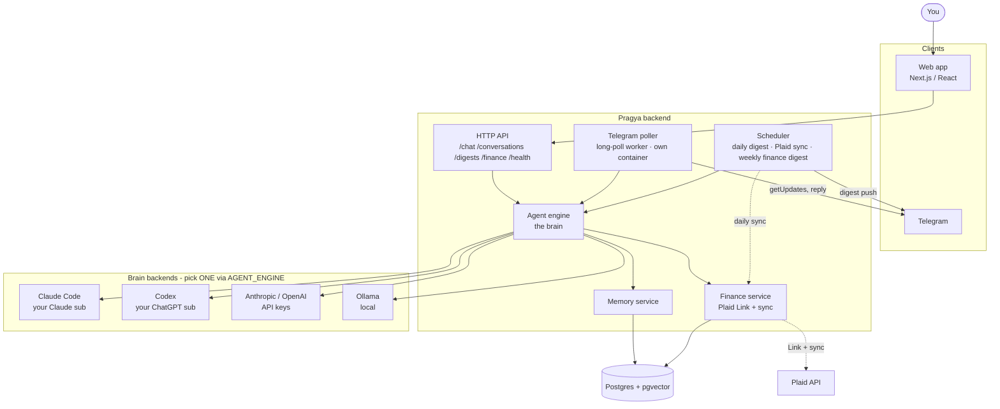

**Key ideas:** the API and memory layers are engine-agnostic — swapping the brain
is a one-line config change (`AGENT_ENGINE`). Pragya is also **proactive** (the
scheduler pushes a daily digest) and **reachable** (a long-polling worker serves
two-way Telegram chat with no public URL).

---

## 2. Backend components (zoom level 1)

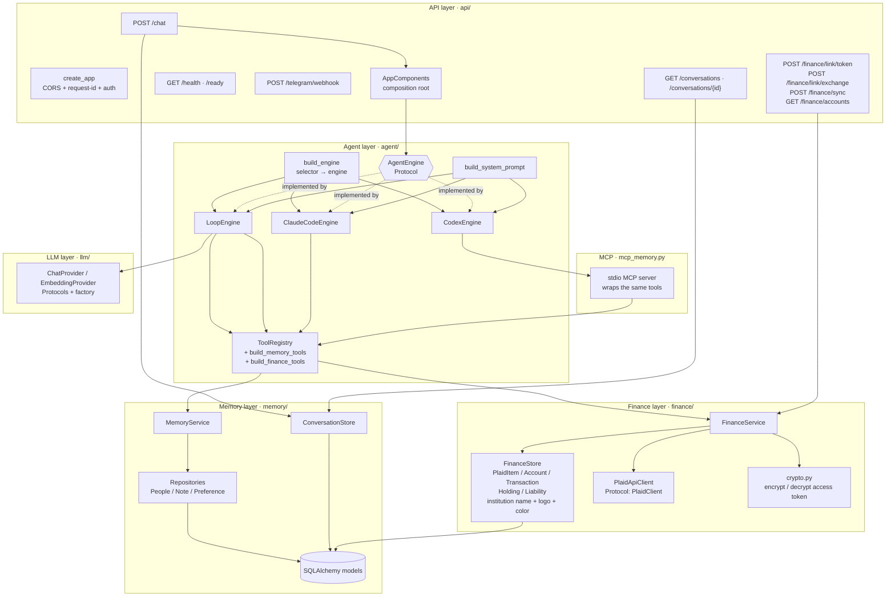

| Layer | Responsibility | Depends on |
|---|---|---|
| **api/** | HTTP surface, auth, request wiring | agent, memory, finance |
| **agent/** | the brain interface + the 3 engines + tools | llm, memory, finance |
| **mcp_memory.py** | expose memory tools over stdio MCP (for Codex) | agent.tools, memory |
| **memory/** | persistence + retrieval (structured + semantic) | llm (embeddings), Postgres |
| **tasks/** | task store + tools (add/list/complete/due) | agent.tools, Postgres |
| **calendars/** | read-only `.ics` service + tools (recurrence, TTL cache) | agent.tools, httpx |
| **digests/** | compose (via engine) + store + deliver the daily digest | agent, memory, telegram |
| **scheduling/** | in-process APScheduler — daily digest + Plaid sync + weekly finance digest | digests, finance |
| **channels/telegram/** | client, webhook + long-poll worker (`process_telegram_update`) | agent, memory |
| **finance/** | Plaid Link + read-only sync (accounts/transactions/holdings/liabilities) | Plaid API, Postgres, crypto |
| **crypto.py** | Fernet symmetric encryption of Plaid access tokens at rest | `APP_SECRET_KEY` |
| **llm/** | provider-agnostic model I/O (chat + embeddings) | vendor SDKs |

Two clean seams keep vendors out of the core:
- **`ChatProvider`** — raw model I/O (one request → one response). Anthropic / OpenAI / Ollama hide behind it.
- **`AgentEngine`** — a whole turn ("given history + message, produce a reply"). The loop is one implementation; Claude Code and Codex are others.

---

## 3. The pluggable brain

One flat selector chooses the engine; loop-based brains additionally pick a `ChatProvider`.

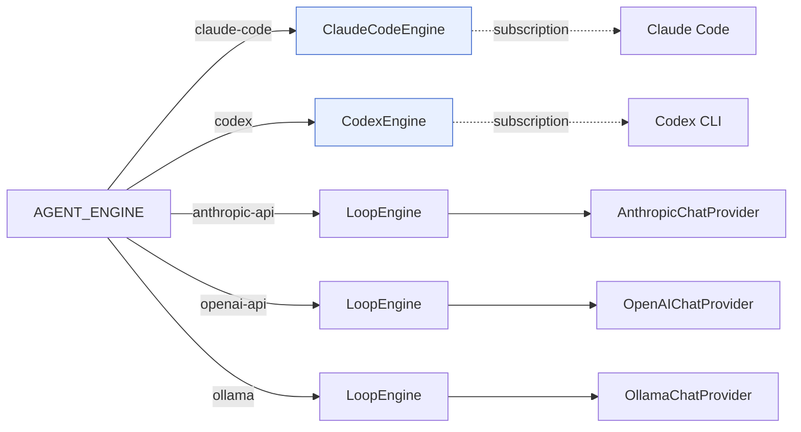

| `AGENT_ENGINE` | Category | Engine | Tools reach memory via | Auth |
|---|---|---|---|---|
| `claude-code` *(default)* | subscription | `ClaudeCodeEngine` | in-process SDK MCP | Claude login / `CLAUDE_CODE_OAUTH_TOKEN` |
| `codex` | subscription | `CodexEngine` | stdio MCP server | `codex login` / `OPENAI_API_KEY` |
| `anthropic-api` | API key | `LoopEngine` | in-process call | `ANTHROPIC_API_KEY` |
| `openai-api` | API key | `LoopEngine` | in-process call | `OPENAI_API_KEY` |
| `ollama` | local | `LoopEngine` | in-process call | none |

All five satisfy the same interface:

```python
class AgentEngine(Protocol):
    async def respond(self, history: list[Message], user_text: str) -> tuple[str, list[Message]]: ...
```

---

## 4. Request lifecycle — what happens on every message

The engine-agnostic outer flow (`/chat`):

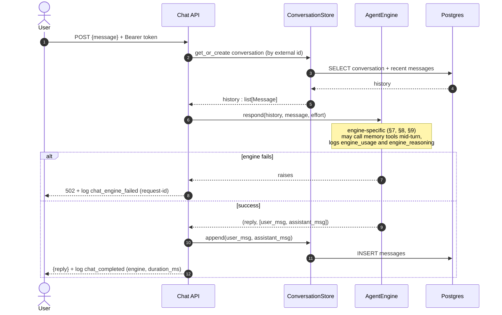

**Persisted on every turn:** the conversation row (created once), plus the user
and assistant messages. Memory writes (notes / people / preferences) happen
*inside* `respond` only when the model decides to call a memory tool. Every turn
also emits structured logs — `chat_completed` (engine, duration) and
`engine_usage` (token counts) — tagged with a per-request id. The web app's
**history sidebar** reads `GET /conversations` (each titled by its first user
message) and loads a chat via `GET /conversations/{id}`.

Each turn also carries an optional per-chat **reasoning effort** — the composer's
Auto/Low/Medium/High selector → `ChatRequest.effort` → the active engine
(Anthropic `output_config.effort` · Claude SDK `effort` · Codex
`model_reasoning_effort`); captured model reasoning is logged as `engine_reasoning`.

---

## 5. Memory model — what's stored

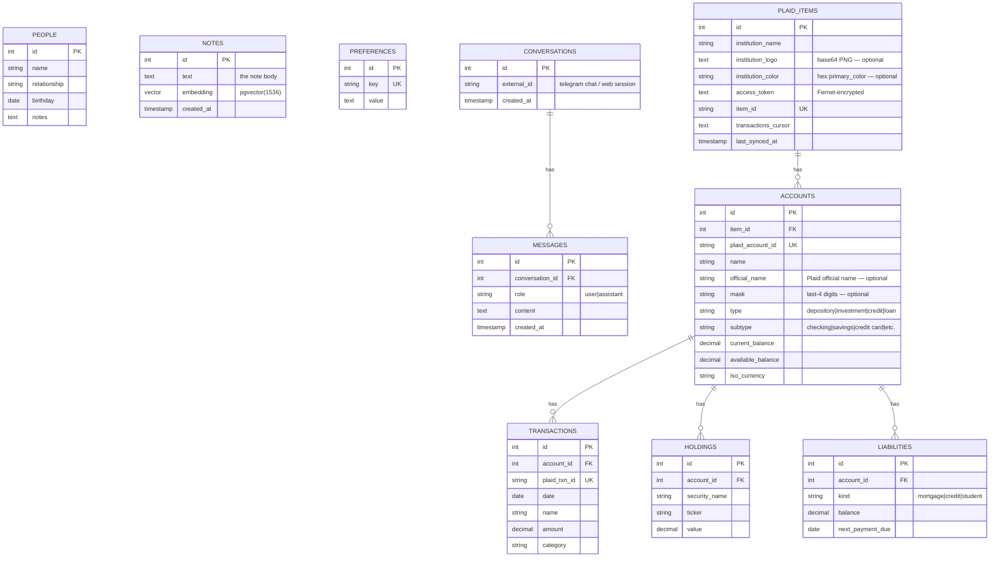

Two kinds of memory, deliberately separate:

- **Episodic (conversation):** `conversations` + `messages` — the raw transcript,
  written every turn, read back as short-term context for the next turn.
- **Semantic / structured (long-term):** `people`, `notes`, `preferences` —
  durable facts the assistant chooses to remember, written only via tools.

---

## 6. When data is persisted, and how it's retrieved

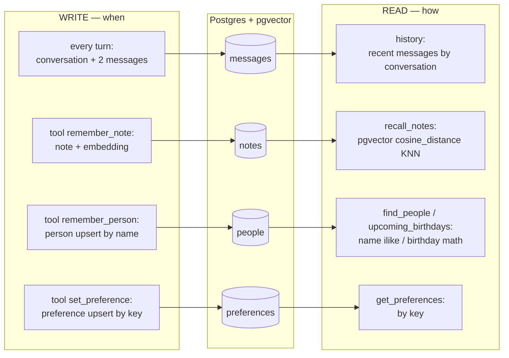

**Semantic recall** is the interesting one — `remember_note` embeds the text on
write; `recall_notes` embeds the *query* and finds nearest neighbours:

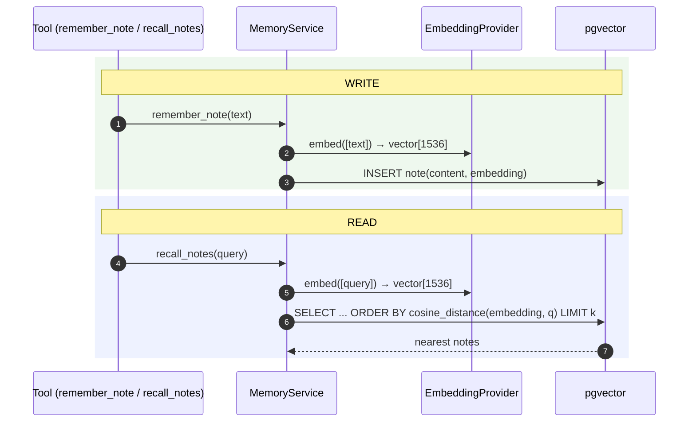

---

## 7. Low-level — the loop engine (API keys / local LLM)

Pragya owns the agent loop: call the model, run any tool calls, repeat until the
model stops asking for tools (bounded by `max_steps`).

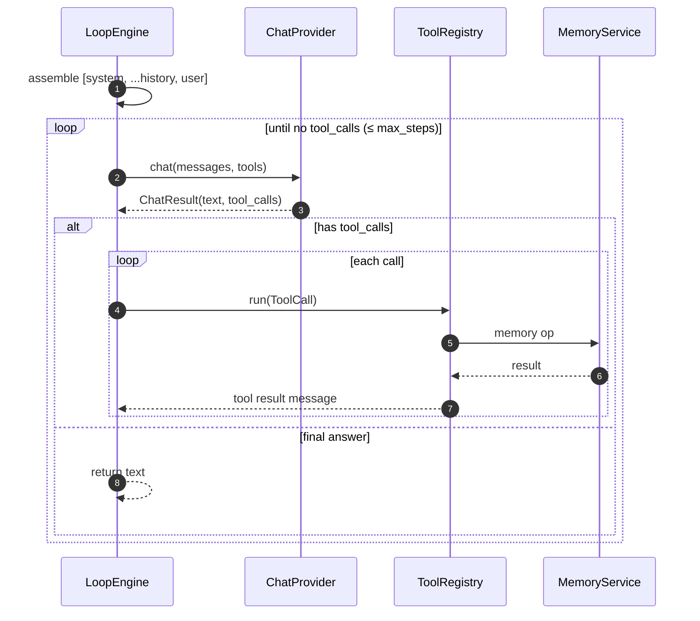

The provider normalizes vendor differences (Anthropic blocks vs OpenAI
tool_calls vs Ollama) into one `ChatResult`/`ToolCall` shape — the loop never
sees vendor types.

---

## 8. Low-level — the Claude Code engine

`ClaudeCodeEngine` delegates the whole turn to **Claude Code** via the Claude
Agent SDK. Our memory tools are registered **in-process** as SDK MCP tools, and
`allowed_tools` restricts Claude Code to *only* those (no bash/file/web).

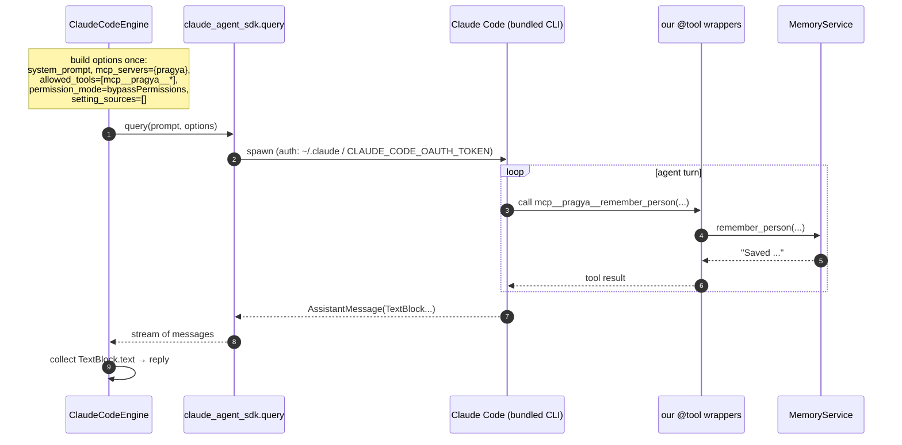

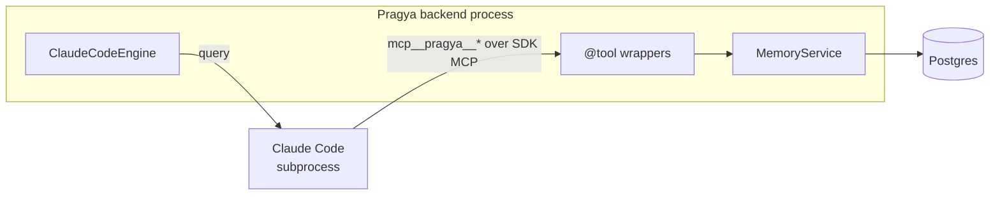

Why in-process MCP: same `Tool` objects the loop uses, zero serialization
service, and Claude Code can only touch memory — nothing else on the box.

---

## 9. Low-level — the Codex engine

Codex has no Python SDK, so `CodexEngine` shells out to `codex exec --json` and
parses its JSONL event stream. Codex is a *separate process*, so our tools are
exposed through a **standalone stdio MCP server** that Codex spawns and calls.

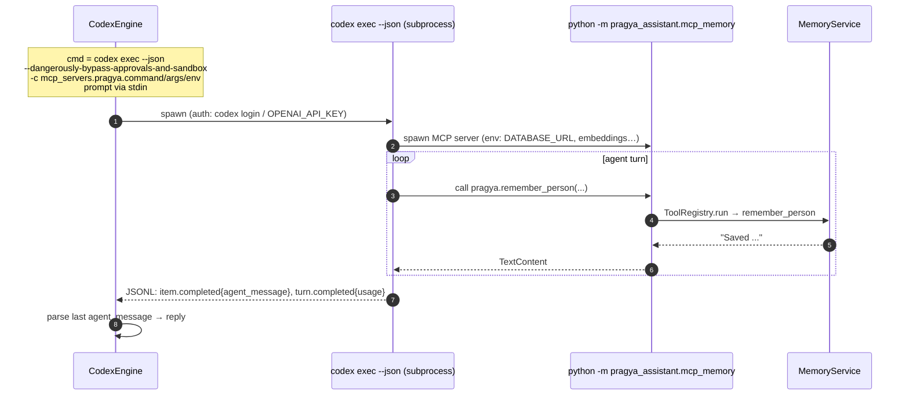

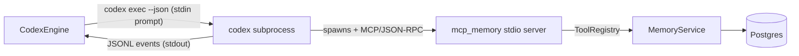

Trade-off (single-user, your machine): Codex runs with
`--dangerously-bypass-approvals-and-sandbox` so the MCP server can reach
Postgres and so headless MCP tool calls work — Codex still only gets *our*
memory tools. The MCP server reuses `build_memory_tools` + `ToolRegistry` — the
**same tool definitions** the other engines use (one source of truth).

---

## 10. Memory-over-MCP — one tool set, three deliveries

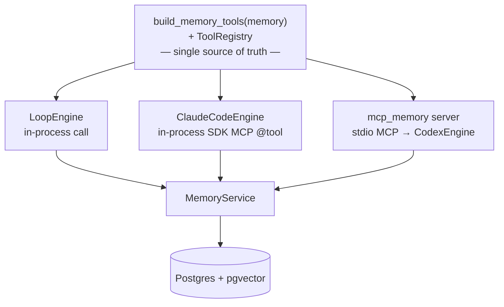

The 7 tools: `remember_note`, `remember_person`, `recall_notes`, `find_people`,
`upcoming_birthdays`, `set_preference`, `get_preferences`. Defined once; the
delivery mechanism differs per engine, the behaviour does not.

---

## 11. Auth & secrets

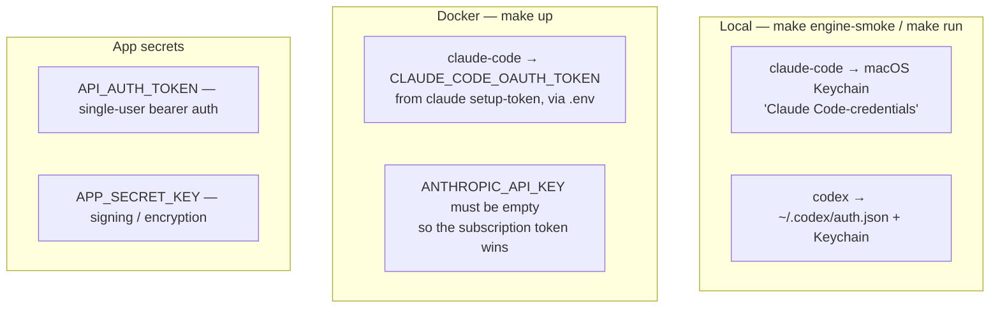

Rules: never commit `.env`; never read provider creds from a workspace-local
`.env`; on the home server, subscriptions are the supported personal-use path;
in cloud, switch to API keys (a config change, by design).

**Fail-fast:** when `APP_ENV ≠ local`, the app refuses to boot with a
placeholder/weak `API_AUTH_TOKEN` or `APP_SECRET_KEY`; it also rejects a known
embedding model paired with the wrong `LLM_EMBEDDING_DIM` at config time (so a
mismatch fails at startup, not mid-chat).

---

## 12. Deployment topology

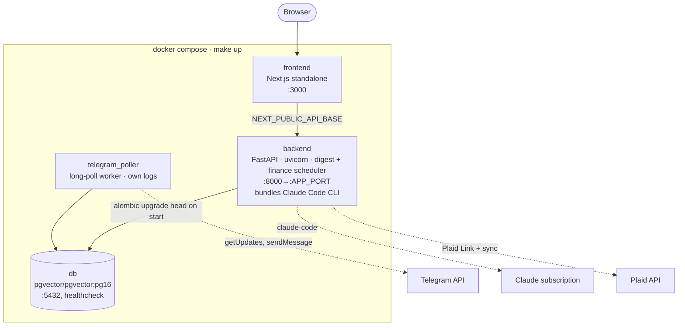

**Plaid Link flow** (Connect-a-bank in the web app):

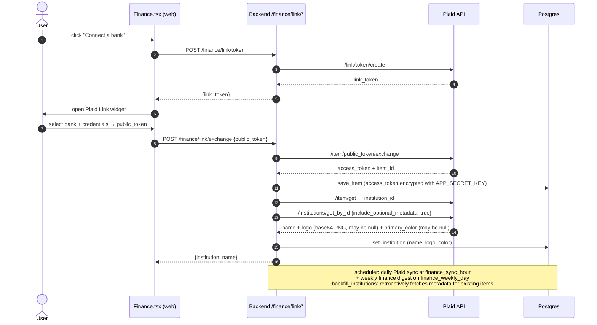

**Finance accounts API + web UI:**

- `GET /finance/accounts` returns `AccountOut` objects each with `institution`,
  `institution_logo` (base64 PNG or null), `institution_color` (hex or null),
  `official_name`, `mask` (last-4 digits), `type`, `subtype`, `current_balance`.
- The **Finance page** (`Finance.tsx`) groups accounts **by institution**, shows a
  brand-color initial badge (or the logo image if present), renders
  `official_name ?? name` + mask suffix (e.g. `•••• 1234`), and displays a **Net
  Worth** headline (assets − credit/loan balances) above all institution groups.
- The `account_balances` chat tool prefixes each balance line with the institution
  name (format: `Institution · Account name (subtype): balance`).
- `PLAID_ENV` = `sandbox` | `production` (set in config; maps to the Plaid SDK
  `Environment`). The free **Trial** plan gives real-data access for up to 10
  connected institutions (Items) with no business enrollment required.

- **Startup order:** db (healthcheck gate) → backend (`alembic upgrade head` then
  serve, running the daily-digest + finance scheduler) → frontend + `telegram_poller`
  (both gated on backend healthy). The poller is its own container/process so its
  logs stay separate (`make logs-poller`).
- **Resilience:** all services run `restart: unless-stopped` (survive reboots);
  `/ready` is a real DB probe (503 when the DB is down) so healthchecks mean something.
- **Backups:** `make backup` → `backups/pragya-<timestamp>.sql.gz`; `make restore FILE=…`.
- **Observability:** structured JSON logs with a per-request id; per-turn
  `chat_completed` (duration) + `engine_usage` (tokens); engine failures surface
  as a clean `502`, never a leaked 500.
- **Tests** run against a separate `pragya_test` database so the suite never wipes
  dev/smoke data.
- **Home-server first, cloud-portable:** same images redeploy to AWS/Azure;
  only auth/secrets sourcing changes.

---

## 13. Roadmap context

- **Phase 1 (done):** walking skeleton — agent loop, memory, API, Telegram, web app, Docker, CI.
- **Phase 2 (done):** pluggable engines — Claude Code, Codex, API/local; memory-over-MCP; conversation-history sidebar.
- **Hardening (done):** fail-fast config, real `/ready`, DB backups, restart policies, clean errors + per-turn usage logging.
- **Phase 3 (done):** proactive daily **digest** (scheduler → Telegram + web), per-chat reasoning effort, **tasks**, read-only **calendar** (.ics), and **two-way Telegram** via a long-polling worker. Remaining 3d: **web search**.
- **Phase 4 (done):** **email** inbox (Gmail/IMAP read → triage → summarize) and **web search** integration.
- **Phase 5 (live — Trial plan, single institution):** **finance** — Plaid Link connect-a-bank flow, read-only sync (accounts/transactions/holdings/liabilities), 6 finance chat tools, Fernet encryption of access tokens at rest, daily Plaid sync + weekly finance digest scheduler jobs, finance line in the daily digest, and a Finance web page. Institution metadata (real name, logo, brand color) fetched via `item/get` → `institutions/get_by_id` (`include_optional_metadata`) on link and via `backfill_institutions` for existing items; stored as `institution_logo` + `institution_color` on `plaid_items` (migrations 0005–0006). Finance page groups accounts by institution with brand-color badges and a Net Worth headline. `PLAID_ENV` = `sandbox` | `production`; currently live against a real institution on the free Plaid Trial plan (up to 10 Items, no business enrollment needed). Single-user only.
- **Later:** WhatsApp/Slack integration, voice interface, opt-in autonomy (draft + send), India Account Aggregator migration (if/when GA).

See [`docs/superpowers/specs/`](superpowers/specs/) for the per-phase design specs.
