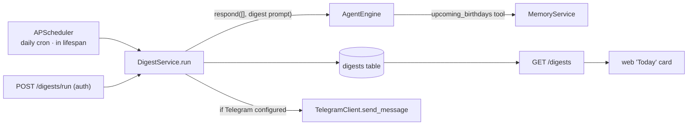
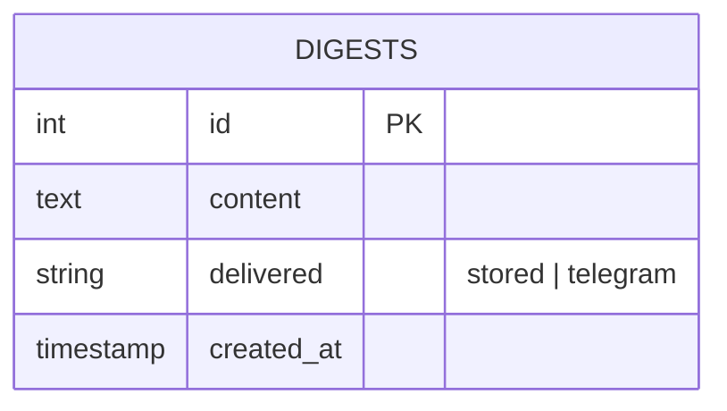

# Phase 3a — Scheduler + First Digest · Design Spec

**Status:** Approved (2026-06-20). First slice of Phase 3 (daily-driver). Makes Pragya **proactive**: it composes a daily digest on a schedule and pushes it to Telegram, storing it for the web app.

**Scope:** scheduler + digest generation + storage + Telegram delivery + a minimal web view. Tasks, calendar, and web search are later Phase-3 slices that plug into this.

---

## 1. Goal

On a daily schedule, Pragya composes a short digest (greeting + upcoming birthdays in the next 7 days), **stores** it, and **pushes** it to the user's Telegram. A manual trigger and an API/web view make it testable and visible.

## 2. Architecture

**Design choices (approved):**
- **In-process scheduler** (APScheduler `AsyncIOScheduler`), started/stopped in the FastAPI lifespan, runs only when `DIGEST_ENABLED`. Simplest for a single always-on home server. *Non-goal:* multi-instance — would need a single-runner guard (note for cloud).
- **Engine-composed digest** — `DigestService` calls the existing `AgentEngine.respond([], DIGEST_PROMPT)`; the brain calls its own `upcoming_birthdays` memory tool and writes a natural digest. Reuses the whole engine/memory stack; ~1 model call/day.

## 3. Components

| File | Responsibility |
|---|---|
| `digests/models.py` (or extend `memory/models.py`) | `Digest` ORM: `id, content, created_at, delivered` |
| `digests/service.py` | `DigestService.run()` → compose via engine → store → Telegram push (if configured); returns the `Digest` |
| `digests/store.py` | `DigestStore`: `add(content, delivered)`, `recent(limit)` |
| `scheduling/scheduler.py` | build + start/stop `AsyncIOScheduler`; register the daily job from config |
| `api/routes/digests.py` | `GET /digests` (recent), `POST /digests/run` (manual) — both `require_token` |
| `api/app.py` | start/stop scheduler in lifespan; wire the digests router |
| `api/deps.py` | build `DigestService` into `AppComponents` |
| `agent/prompts.py` | `build_digest_prompt(today)` |
| migration | create `digests` table |
| frontend | `lib/api` (`listDigests`, `runDigest`) + a "Today" card in `Workspace` |

## 4. Data model

## 5. Config (new)

| Key | Default | Meaning |
|---|---|---|
| `DIGEST_ENABLED` | `true` | run the scheduled job |
| `DIGEST_HOUR` | `8` | local hour (0–23) |
| `DIGEST_MINUTE` | `0` | minute |
| `DIGEST_TIMEZONE` | `UTC` | e.g. `Asia/Kolkata` |

New dependency: `apscheduler`. Telegram push reuses existing `TELEGRAM_BOT_TOKEN` + `TELEGRAM_ALLOWED_CHAT_IDS` (push skipped + logged if unset).

## 6. Behaviour

- **Generate:** `DigestService.run()` → `engine.respond([], build_digest_prompt(today))` → digest text.
- **Store:** always insert a `digests` row.
- **Deliver:** if Telegram configured, `send_message` to each allowed chat id; mark `delivered="telegram"`, else `"stored"`. A delivery failure is logged, never crashes the job (digest is still stored).
- **Schedule:** a daily cron job at `DIGEST_HOUR:DIGEST_MINUTE` in `DIGEST_TIMEZONE`; only registered when `DIGEST_ENABLED`.
- **Manual:** `POST /digests/run` runs `DigestService.run()` now (for testing / on-demand).
- **Observability:** structured logs `digest_generated` (length) + `digest_delivered` (channel, chat count), request-id where applicable.

## 7. Testing

- `DigestService.run()` — fake engine (returns canned digest) + fake Telegram (records sends) + real DB: stores a row; pushes when configured; **skips push gracefully** when not; never raises on Telegram error.
- `DigestStore` — add/recent ordering.
- Endpoints — `GET /digests` returns recent; `POST /digests/run` generates + returns; both 401 without token.
- Scheduler — building it registers a job at the configured time; disabled when `DIGEST_ENABLED=false` (no live timing).
- **Live smoke:** `POST /digests/run` → digest generated on the subscription, stored, and (with Telegram configured) delivered to the phone.

## 8. Non-goals (this slice)
- Tasks/reminders, calendar, web search (later slices feed the same digest).
- Two-way Telegram chat / webhook (needs a public URL) — push only here.
- Per-section digest customization, multiple digests/day, multi-user.
