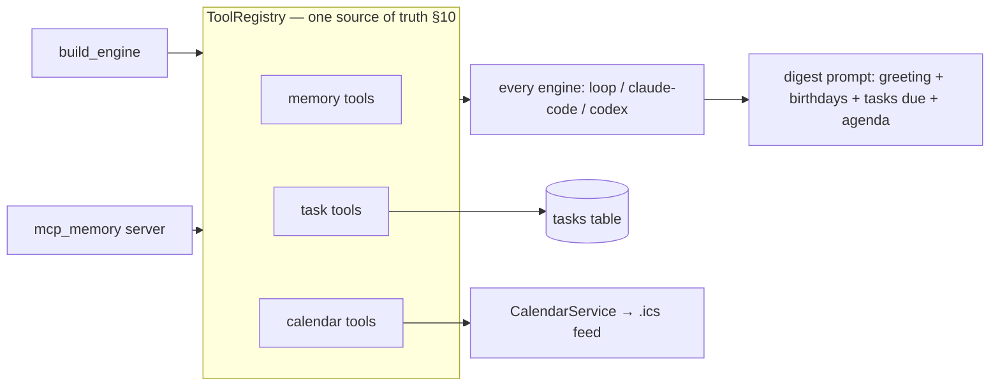
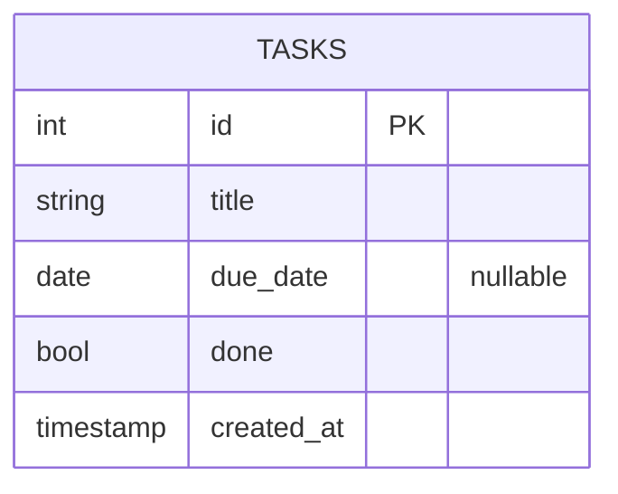

# Phase 3b/3c — Tasks + Calendar (in the Digest) · Design Spec

**Status:** Approved (2026-06-20). Two Phase-3 slices built together because they share one integration layer (engine tools + the digest). Both make Pragya more useful day-to-day: capture/track tasks, and read your calendar.

**Scope:** task storage + tools; read-only calendar (`.ics`) service + tools; fold both into the digest; expose to all engines. No dedicated web UI in v1 (managed in chat, surfaced in the digest).

---

## 1. Shared integration

- **`build_task_tools(task_store)`** and **`build_calendar_tools(calendar_service)`** join the existing `build_memory_tools(memory)`. The engine factory and the Codex stdio MCP server both assemble **memory + tasks + calendar** into the `ToolRegistry` — so loop / claude-code / codex all get them via their existing delivery.
- **`build_digest_prompt`** extended: the engine also lists **tasks due/overdue** and **today's agenda** (it calls the new tools). Calendar lines are simply absent when `CALENDAR_ICS_URL` is unset.

## 2. 3b — Tasks & reminders

- **Migration `0003`** creates `tasks`.
- **`TaskStore`** (`tasks/store.py`): `add(title, due_date=None)`, `list(include_done=False)`, `complete(id)`, `due(within_days=0)` (not-done, `due_date` ≤ today+N **or** overdue, ordered by due date).
- **Tools** (`tasks/tools.py` → `build_task_tools`): `add_task(title, due_date?)`, `list_tasks()`, `complete_task(id)`, `due_tasks(within_days=0)`. Dates parsed as ISO `YYYY-MM-DD`.
- **Surfaced:** chat (add/list/complete) + digest (due/overdue).

## 3. 3c — Calendar (read-only `.ics`)

- **Config:** `CALENDAR_ICS_URL: str | None = None` (secret iCal feed). Feature off when unset.
- **`CalendarService`** (`calendar/service.py`): fetch the feed (httpx), parse with `icalendar`, expand recurrences with `recurring-ical-events`, return events for a date / range as `(start, end, summary, location)`. ~5-min in-memory TTL cache keyed by URL (avoid refetch per tool call). Injected `clock` + `fetcher` for testability.
- **Tools** (`calendar/tools.py` → `build_calendar_tools`): `agenda(date?)` (default today), `upcoming_events(days=7)`. Return "Calendar not configured" when no URL.
- **Surfaced:** chat ("what's on today?") + digest (today's agenda).
- **Deps:** `icalendar`, `recurring-ical-events`.

## 4. Config (new)

| Key | Default | Meaning |
|---|---|---|
| `CALENDAR_ICS_URL` | `None` | secret iCal feed URL; calendar off if unset |

## 5. Testing (TDD)

- **TaskStore** — add/list/complete; `due()` includes overdue + within-window, excludes done/future; ordering.
- **Task tools** — each tool's behavior incl. bad date input + completing a missing id.
- **CalendarService** — parse a sample `.ics` fixture (a single event + a **weekly recurring** event); `agenda(date)` returns the right events for a given day incl. an expanded recurrence; cache avoids refetch (fetcher called once); empty/garbage feed handled.
- **Calendar tools** — `agenda`/`upcoming_events`; "not configured" path.
- **Integration** — engine `ToolRegistry` includes the new tools (loop + mcp_memory); `build_digest_prompt` mentions tasks + agenda; existing digest/engine tests stay green.
- Network is always mocked (respx) — no live `.ics` fetch in tests.

## 6. Non-goals (this slice)
- Calendar write / RSVP / multiple feeds (one URL in v1).
- Google OAuth / CalDAV (the chosen path is the secret `.ics` feed; OAuth is a later upgrade).
- Timed per-task push reminders (due dates surface in the daily digest; no separate scheduler entries).
- Dedicated web Tasks/Calendar panels (chat + digest cover v1).
