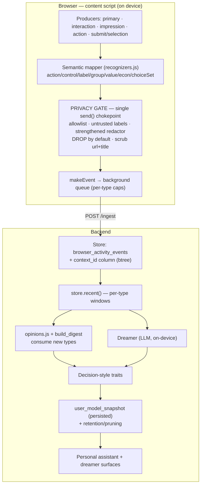

# Nidra End-to-End Activity Capture & Holistic User Model — Design

- **Date:** 2026-06-27
- **Status:** Approved design, pre-implementation
- **Scope:** One spec, built together (no phasing): three new event types, a hardened
  privacy gate, decision-style trait derivation, and a persisted user model.

## 1. Goal

Capture user web activity end-to-end so the personal assistant and the on-device
"dreamer" can build a **holistic model of the user** — not just *what* pages were
visited, but *what choices were made and how*, so downstream reasoning is sharper.

Today the pipeline captures `pageview / reading / search / email / calendar /
form_input / selection` plus engagement metrics (`dwellMs / scrollPct / readPct`).
The blind spot: **on-page decisions** — toggling an option, selecting from a set,
progressing or abandoning a flow — are invisible because the content script only
listens for form *submit* and text *selection*, never clicks/`change` on controls.

## 2. Principles & non-goals

- **Privacy is the spine, not a feature.** Capture the *decision*, never raw
  sensitive values. Semantic descriptors only; DROP by default when unsure.
- **Domain-agnostic.** The data model uses abstract UI roles (control, label,
  group, action verb), not domain terms. It must work for checkouts, settings
  pages, paywalls, seat maps, dashboards — anything.
- **Feed the existing layers.** New events flow into `opinions.js` and the dreamer;
  we do not build a parallel understanding system.
- **No regression.** Adding high-frequency events must not degrade the existing
  dreamer/opinions output.
- **Non-goals:** all-viewport session replay; capturing payment credentials or
  PII; cross-site identity stitching; inferring protected attributes
  (health/religion/politics) as stored traits.

## 3. Event taxonomy

Three new values added to `EVENT_TYPES` (`schema.js`). `event_type` is a free
`String(32)` column, so this is additive with no DB enum change.

| type | meaning | example (one of many domains) |
|---|---|---|
| `impression` | a **decision-point** was shown: choice elements / offers / CTAs (capped IntersectionObserver, debounced) | "shown: 3 plan options + primary CTA" |
| `interaction` | a **semantic** click / toggle / select — the decision, never the raw value | "selected option in group 'Plan' = annual" |
| `action` | a **funnel milestone** | "reached step 3 of 4", "submitted", "abandoned" |

### Existing types (retained, unchanged)

`pageview` (visited a page — the fallback navigation event, carries dwell/scroll
metrics), `reading` (read long-form content + word count), `search` (ran a query),
`email` / `calendar` (webmail / gcal activity), `form_input` (typed a non-sensitive
field), `selection` (highlighted text). All share the same `makeEvent` envelope.

### How the altitudes fit together

| altitude | types | answers |
|---|---|---|
| **Page** | `pageview` (every visit), `reading` (article-grade) | "I was here" |
| **Element** | `impression` (a choice was shown), `interaction` (a control was acted on) | "this was shown / I picked this" |
| **Flow** | `action` (funnel milestone across steps) | "I reached this stage" |

`pageview` is **not** redundant with `action`: `pageview` fires for every page
visit; `action` fires only inside a flow when a milestone is reached.
`impression` / `interaction` sit *below* the page — sub-page decision points within
it. One visit can emit all four altitudes (e.g. `pageview` → `impression` →
`interaction` → `action`), correlated by `context_id` (§7–8).

## 4. Generalized data model

### 4.1 Envelope (unchanged)

```
Event = {
  v, ts, type,
  url, domain, title, source,
  data:    { … },                                    # type-specific (below)
  metrics: { dwellMs, scrollPct, readPct, latencyMs },# latencyMs is new
  redacted: bool,
}
```

### 4.2 `data` vocabulary (abstract roles, open value sets)

| field | meaning | example values (open set) |
|---|---|---|
| `action` | the verb | `select` `deselect` `toggle_on` `toggle_off` `choose` `add` `remove` `submit` `open` `dismiss` `expand` `sort` `filter` `step` |
| `control` | UI control kind (from ARIA role / tag) | `toggle` `radio` `checkbox` `dropdown` `button` `link` `stepper` `slider` `tab` `card` `menuitem` |
| `label` | accessible label of the element (**untrusted; redacted**) | any text |
| `group` | semantic section (fieldset / `aria-labelledby` / heading) | any text |
| `value` | **non-sensitive** resulting value | `on`/`off`, chosen option label, a count, an enum |
| `valueClass` | sensitivity verdict from the gate | `enum` `numeric` `boolean` `text_safe` `redacted` `dropped` |
| `econ` | optional economic context near the control | `{ amount, currency, unit }` |
| `choiceSet` | sibling options presented (impression / at decision) | `[{ label, econ?, selected? }]` |
| `milestone` | for `action` only | `reached_checkout` `submitted` `completed` `abandoned` `added` `started` |
| `contextId` | page-load correlation id (mirrored to a column, §7) | uuid |
| `elementKey` | stable per-element key for impression dedup (§5.3) | bounded hash |

### 4.3 Cross-domain instantiations (the "don't overfit" proof)

```jsonc
// SaaS settings
{ type:"interaction", data:{ action:"toggle_off", control:"toggle",
  label:"Two-factor authentication", group:"Security", value:"off", valueClass:"boolean" } }

// E-commerce product options
{ type:"interaction", data:{ action:"select", control:"dropdown",
  label:"Size", group:"Options", value:"M", valueClass:"enum" } }

// Paywall impression (what was offered)
{ type:"impression", data:{ group:"Subscribe", choiceSet:[
    {label:"Annual",  econ:{amount:99, currency:"USD", unit:"year"}},
    {label:"Monthly", econ:{amount:12, currency:"USD", unit:"month"}}],
  cta:["Start free trial"] } }

// Funnel milestone (any vertical)
{ type:"action", data:{ milestone:"abandoned", funnel:"checkout", step:3, of:4 } }

// Sensitive control — gate DROPS it (no event emitted)
//   <input name="cardNumber">, <input type="password">, a "Pay with Visa ••4242" radio
```

## 5. Capture mechanics (extension)

### 5.1 Producers

A new capture module is added; `content.js` is refactored so **every** producer
emits through a single `gate()` (§6) rather than calling `send()` directly. This
includes rerouting the existing `submit` / `selection` / `emitPrimary` paths and
the `background.js` history-backfill path.

- **Interaction capture:** delegated `click` + `change` listeners on the document.
  Resolve the nearest meaningful control (button / input / `[role]`), then hand the
  node to the semantic mapper.
- **Impression observer:** an `IntersectionObserver` over **decision elements only**
  (controls, option cards, price-bearing nodes, CTAs), capped per page and debounced.
  Re-armed on SPA/dynamic mounts via a `MutationObserver` that currently only does
  route detection.
- **Action detector:** maps recognized milestones (URL/step patterns, submit, an
  unload without completion → `abandoned`).

### 5.2 Semantic mapper (`recognizers.js`)

`describeInteraction(node)` / `describeImpression(node)` produce the abstract
descriptor in §4.2 from the DOM: control kind from ARIA role/tag; `label` from
accessible name; `group` from fieldset/`aria-labelledby`/nearest heading; `econ`
from nearby price text; `value` from checked/selected state.

### 5.3 Stability & accuracy fixes (from review)

- **`elementKey` stability:** derive from a stable signature (role + group + label
  hash), not DOM position, so React remounts/virtualized lists don't create
  duplicates or collisions. Bounded length so `contextId:elementKey` fits
  `client_id` `varchar(128)`.
- **First-seen, not last-seen:** impressions record `shownAt` at first intersection
  and are **not** overwritten on re-entry, so `latencyMs` (shown → first interaction)
  stays correct.
- **Latency measurement:** use IntersectionObserver entry time + `performance.now()`,
  paused on `visibilitychange:hidden` (avoids the background-tab clock drift that
  also affects `dwellMs`).
- **Throttle before send:** per-element throttle + per-page impression cap *before*
  enqueue, so the background ring buffer and network aren't flooded.

## 6. Privacy gate (single chokepoint)

All producers funnel through one `gate(candidate) → emit | redact | drop`:

1. **Allowlist of safe control kinds + sections.** Only recognized non-sensitive
   controls/sections pass. Unknown → DROP.
2. **Every derived string is untrusted.** `label` / `group` / `choiceSet[].label`
   are treated as free text that may contain PII (e.g. "Pay with Visa ••4242",
   "Ship to 221B Baker St"). `isSensitiveInput`'s field-name regex does **not**
   protect clicks on non-input controls, so it is not relied on here.
3. **Strengthened redactor.** Extend `redactString` to catch names, street
   addresses, DOB, separated phone numbers, JWTs/API keys, and short/partial PANs —
   not just the current email / contiguous-digit / SSN patterns.
4. **DROP by default.** Payment credentials, password/auth, and anything that
   redacts to "mostly removed" or fails the allowlist is dropped entirely.
5. **Scrub the envelope too.** `url` and `title` are sanitized for the new event
   types, since a sensitive *page* leaks regardless of value scrubbing.

**Payment-method decision (defaulted, confirm in review):** a top-frame payment
*method* choice that is a plain enum (e.g. "Apple Pay" vs "Card") with a
non-sensitive label is allowed as `value`/`enum`; any label containing an
instrument identifier (brand + last4, account name) is DROPPED. Embedded payment
*iframes* are out of reach by design (`all_frames:false` stays false — see §13).

## 7. Storage & data model (DB)

- **Substrate reuses `browser_activity_events`.** New types are new `event_type`
  string values; payload rides the existing `data` + `metrics` JSONB columns.
- **New column `context_id`** (`String(36)`, nullable, **btree index** on
  `(connector_key, context_id)`). Correlation query is `WHERE context_id = ?`
  (equality) — a btree, not a broad JSONB GIN, which would not serve `->>` equality
  and would bloat on this high-churn table. `contextId` is also mirrored in `data`
  for portability. Migration mirrors `0014_browser_activity_metrics.py`.
- **Write semantics:**
  - `interaction` / `action`: append-only, fresh `uuid()` `client_id` (as
    `selection` / `form_input` already do).
  - `impression`: deduped via `client_id = contextId + ":" + elementKey`,
    reusing the existing upsert-by-`client_id`.
  - `add_events` gains `ON CONFLICT`-style upsert / `IntegrityError` handling so a
    deduped key racing across tabs cannot 500.
- **Per-type read windows (no-regression):** `store.recent()` becomes per-type
  (e.g. keep the dreamer's reading/search/email/calendar window intact and cap
  interaction/impression/action separately) so high-frequency new events never
  evict the rows the dreamer already consumes.

### 7.1 ORM models

`BrowserActivityEvent` (existing model, `memory/models.py`) — only the marked
lines are new; everything else exists today:

```python
class BrowserActivityEvent(Base):
    __tablename__ = "browser_activity_events"
    __table_args__ = (
        UniqueConstraint("connector_key", "client_id", name="uq_browser_activity_client"),
        Index("ix_browser_activity_context", "connector_key", "context_id"),  # NEW: btree for correlation
    )

    id: Mapped[int] = mapped_column(primary_key=True)
    connector_key: Mapped[str] = mapped_column(String(100), index=True)
    client_id: Mapped[str] = mapped_column(String(128), index=True)
    event_type: Mapped[str] = mapped_column(String(32), index=True)   # + impression|interaction|action
    ts: Mapped[dt.datetime] = mapped_column(index=True)
    source: Mapped[str | None] = mapped_column(String(64), default=None)
    domain: Mapped[str | None] = mapped_column(String(255), default=None, index=True)
    url: Mapped[str | None] = mapped_column(Text, default=None)
    title: Mapped[str | None] = mapped_column(Text, default=None)
    data: Mapped[dict[str, Any] | None] = mapped_column(JSONB, default=None)
    metrics: Mapped[dict[str, Any] | None] = mapped_column(JSONB, default=None)  # now also latencyMs
    context_id: Mapped[str | None] = mapped_column(String(36), default=None)      # NEW: page-load correlation id
    redacted: Mapped[bool] = mapped_column(default=False)
    created_at: Mapped[dt.datetime] = mapped_column(server_default=func.now())
```

Migration `0015_browser_activity_context_id.py` (mirrors `0014`):

```python
def upgrade() -> None:
    op.add_column(
        "browser_activity_events",
        sa.Column("context_id", sa.String(length=36), nullable=True),
    )
    op.create_index(
        "ix_browser_activity_context", "browser_activity_events",
        ["connector_key", "context_id"],
    )
```

Note: `Index` must be added to the `sqlalchemy` import in `models.py`. No broad
JSONB GIN index — the correlation query is `WHERE connector_key = ? AND
context_id = ?` (equality), which a btree serves; a GIN on `data` would not.

## 8. Correlation

`context_id` ties `impression → interaction → action` within one page load. It
scopes to a page, not a single decision; `group` + `elementKey` scope within the
page. This lets derivation answer "was the chosen option the cheapest of the set
shown?" and "was the flow abandoned after reaching payment?".

## 9. Consumers & no-regression

- `build_digest` (dreamer) and `deriveOpinions` (`opinions.js`) are extended to
  consume `impression` / `interaction` / `action`, summarizing decisions
  ("chose annual over monthly", "abandoned checkout at step 3").
- The dreamer `SYSTEM` prompt is extended to weight decisions and reason about
  decision *style*.
- Per-type windows (§7) guarantee the existing reading/search digest is unchanged
  in volume.

## 10. Decision-style derivation (traits)

Computed over the substrate (deterministic in `opinions.js`; richer induction in
the dreamer). Initial heuristics (refined during implementation):

| trait | signal |
|---|---|
| `decisiveness` | low `latencyMs` shown→action; few reversals |
| `deliberation` | toggle/select reversals on the same `elementKey`/`group` |
| `comparison_breadth` | distinct competing options/domains viewed before a choice |
| `abandonment` | `action:abandoned` rate across funnels |
| `premium_tolerance` | chose a higher-`econ` option when a cheaper one was in `choiceSet` |
| `convenience_affinity` | opts into convenience add-ons / one-click methods |

Each trait carries `{ value, confidence, evidence, provenance }` (same shape as
existing beliefs). Trait names are an open, growing set; no domain is hardcoded.

## 11. Persisted user model

New model `UserModelSnapshot` (`memory/models.py`), table `user_model_snapshots`:

```python
class UserModelSnapshot(Base):
    """A point-in-time derived trait/preference about the user. Append-only:
    each derivation pass writes fresh rows so a trait can be tracked as it
    evolves. The "current model" is the latest row per trait."""

    __tablename__ = "user_model_snapshots"
    __table_args__ = (
        Index("ix_user_model_trait_time", "trait", "computed_at"),  # latest-per-trait reads
    )

    id: Mapped[int] = mapped_column(primary_key=True)
    trait: Mapped[str] = mapped_column(String(100), index=True)      # "decisiveness", "preference:payment"
    value: Mapped[Any] = mapped_column(JSONB)                        # scalar | label | struct
    confidence: Mapped[float] = mapped_column(default=0.0)
    evidence: Mapped[int] = mapped_column(default=0)                 # # of corroborating signals
    provenance: Mapped[list[str] | None] = mapped_column(JSONB, default=None)  # ["interaction", "action"]
    computed_at: Mapped[dt.datetime] = mapped_column(server_default=func.now(), index=True)
```

Migration `0016_user_model_snapshots.py`:

```python
def upgrade() -> None:
    op.create_table(
        "user_model_snapshots",
        sa.Column("id", sa.Integer(), primary_key=True),
        sa.Column("trait", sa.String(length=100), nullable=False),
        sa.Column("value", postgresql.JSONB(astext_type=sa.Text()), nullable=False),
        sa.Column("confidence", sa.Float(), nullable=False, server_default="0"),
        sa.Column("evidence", sa.Integer(), nullable=False, server_default="0"),
        sa.Column("provenance", postgresql.JSONB(astext_type=sa.Text()), nullable=True),
        sa.Column("computed_at", sa.DateTime(), server_default=sa.func.now(), nullable=False),
    )
    op.create_index("ix_user_model_snapshots_trait", "user_model_snapshots", ["trait"])
    op.create_index("ix_user_model_trait_time", "user_model_snapshots", ["trait", "computed_at"])
```

Append-only (history), not upsert — so trait evolution is queryable; "current
model" = latest row per `trait`.

The derivation/dreamer pass writes snapshots so traits persist and **evolve over
time**, and the assistant can read the current model cheaply (instead of
recomputing per request). The existing ephemeral `/dream` result remains available.

## 12. Retention

Raw substrate (especially impressions) is pruned after a configurable window once
distilled into `user_model_snapshot`, bounding table growth. Window is a setting.

## 13. Known limitations (explicit)

- **Iframes:** `all_frames:false` (`manifest.json:22`) stays false for privacy, so
  embedded checkout/payment iframes (Stripe/PayPal) are not observed — payment-method
  capture is best-effort top-frame only.
- **Shadow DOM:** closed roots are unobservable; open roots retarget events to the
  host — `label`/`control` resolution is best-effort.
- **Virtualized / dynamic lists:** mitigated by stable `elementKey` + re-armed
  observers, but recycled nodes remain a known source of impression noise.

## 14. Architecture



## 15. File-by-file change map

**Extension**
- `schema.js` — add `impression`/`interaction`/`action` to `EVENT_TYPES`; add
  `latencyMs` to metrics doc.
- `recognizers.js` — `describeInteraction`, `describeImpression`, stable
  `elementKey`, strengthened `redactString`.
- `content.js` — interaction + impression + action capture; refactor so all
  producers route through `gate()`; latency via `performance.now()`.
- `gate.js` (new) — the single privacy chokepoint.
- `background.js` — route backfill through `gate()`; per-type caps in the buffer.
- `opinions.js` — consume new types; decision-style traits.

**Backend**
- `memory/models.py` — add `context_id` column + `ix_browser_activity_context`
  index to `BrowserActivityEvent`; new `UserModelSnapshot` model; import `Index`.
- `migrations/versions/0015_browser_activity_context_id.py` — add `context_id` + btree index.
- `migrations/versions/0016_user_model_snapshots.py` — create `user_model_snapshots` table.
- `connectors/browser_activity/store.py` — `context_id` field; per-type
  `recent()`; upsert/IntegrityError handling.
- `connectors/browser_activity/dreamer.py` — digest consumes new types; prompt
  update; trait derivation.
- `api/routes/browser_activity.py` — `ActivityEventIn` accepts new fields
  (`context_id`, action/impression payloads).

## 16. Testing strategy (TDD)

- **Recognizers:** descriptor extraction across control kinds; `elementKey`
  stability across re-render; redactor catches each new PII class.
- **Gate:** allowlist passes safe controls; DROPs payment/PII/unknown; envelope
  scrubbed; payment-method enum vs instrument-label cases.
- **Store:** `context_id` round-trips; per-type windows isolate the dreamer window;
  impression dedup upserts, interaction appends; race on deduped key doesn't 500.
- **Derivation:** each trait from a crafted event sequence; provenance correct.
- **Ingest:** new fields validated and persisted end-to-end.
- **Dreamer digest:** new types summarized; reading/search summary unchanged in
  volume (no-regression assertion).

## 17. Decisions log

- All three event types + traits + persisted model built **together** (no phasing).
- Privacy model is **allowlist + DROP-by-default**, not denylist-scrub.
- Correlation via a **real `context_id` column + btree**, not JSONB GIN.
- Payment **method** enum allowed top-frame; **credentials** and instrument labels
  dropped; iframes out of scope. *(Confirm in review.)*
- `latencyMs` included.
