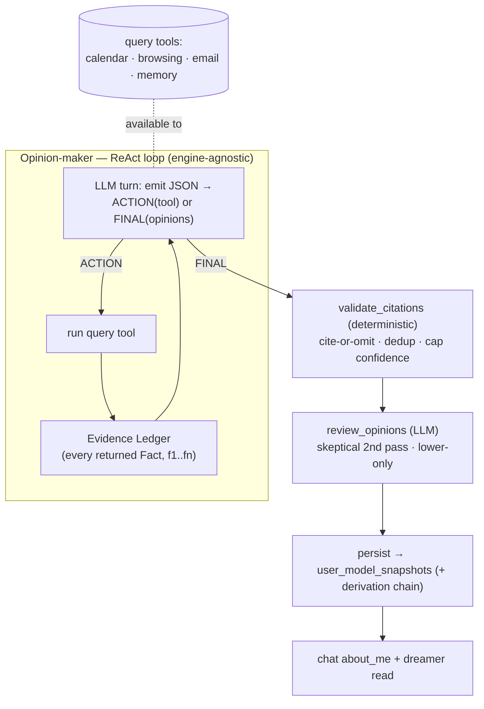

# Nidra — Opinion-Forming as a Tool-Using Agent

- **Date:** 2026-06-27
- **Status:** Approved design (revised), pre-implementation
- **Revises:** the first cut of this spec, which formed opinions from a *static, pre-fetched
  fact digest* fed to one-shot LLM calls. This revision makes the opinion-maker a
  **tool-using ReAct agent** that *pulls* the data it needs, widens the calendar
  connector to carry past **and** future, and **decouples** the opinion subsystem from
  the dreamer (shared neutral utilities, separate routes, legacy duplicate retired).
- **Builds on:** the architecture in `2026-06-27-nidra-opinions-dreams-rsi-design.md`
  (Opinions = grounded facts; Dreams = speculation; one-way valve between them).

## 0. Why this revision

Three problems with the first cut:

1. **Calendar was inert.** The fact builder queried calendar *backward* (`now−30d → now`),
   but the connector only persists `[now−1d, now+30d]` — the windows barely overlap, so
   the strongest signal (an upcoming booked flight; a recurring weekly 1:1) never became a
   fact. Both **past routines** and **future commitments** describe the user and must be
   available.
2. **The opinion-maker was handed a fixed snapshot.** A pre-fetched digest can't decide
   "I should look back 90 days for routines, or ahead 60 for plans." The opinion-maker
   should **query data as it needs it** — especially calendar windows.
3. **Opinions were coupled to the dreamer.** `opinion_workflow.py` imported `extract_json`
   from `user_model/dreamer.py`; the opinions route imported `engine_dream_fn` (dreamer) and
   `ollama_dream_fn` (a *connector* module). There are two dreamer modules, two dream
   routes, `extract_json` duplicated, and `DreamFn` defined three times. Opinions and
   dreams are deliberately separate subsystems; they must not import each other.

## 1. Principles (the invariants do not change)

- **Opinions = facts, not guesses.** High-confidence, fact-based, **cited**, no imagination.
  Speculation stays in Dreams.
- **Cite-or-omit, enforced deterministically.** Every opinion cites the exact signals
  behind it; uncited opinions are dropped by code, not trusted to the prompt.
- **Confidence is earned.** The LLM proposes confidence; a deterministic step caps it by
  evidence strength; the reviewer can only lower it.
- **Auditable.** Every opinion persists a `derivation` evidence chain to its facts.
- **NEW — the opinion-maker investigates.** It is an agent with tools that pulls data
  (browser, calendar past+future, email, memory) as needed, rather than consuming a fixed
  digest.

## 2. Architecture — the opinion agent



### 2.1 The agent loop is engine-agnostic (works with the `claude-code` default)

The opinion-maker is driven by a **small orchestrated ReAct loop** in our code, over the
neutral `CompletionFn` (prompt → text). Each turn the model returns JSON that is **either**:

- an **action** — `{"action": "query_calendar", "args": {"days_back": 90, "days_ahead": 60}}` — or
- the **final** result — `{"opinions": [{"trait","value","confidence","evidence_fact_ids"}]}`.

On an action we run the tool, append its result as an observation, and loop; on final we
stop. Bounded by `max_steps` (default 6); if the model never emits `opinions`, we terminate
gracefully with whatever it produced (possibly none).

**Decision (documented for review):** we drive the loop ourselves over a text-action
protocol rather than using `LoopEngine`'s native `tool_calls`. Reason: the user's default
brain is `claude-code` (`ClaudeCodeEngine`), a CLI wrapper that does **not** plug into
`LoopEngine`'s provider/tool-call model. A text-action loop works with **every** engine
(claude-code, codex, api, ollama) and stays fully testable (inject a `CompletionFn` that
returns a scripted action→…→final sequence). Tradeoff: text-action parsing is slightly less
robust than a provider's structured tool-calls; acceptable, and a future optimization can
use native tool-calls when the brain supports them.

### 2.2 Query tools (the investigation surface)

Each tool is a thin wrapper over the **existing fact collectors** (reused from `facts.py`),
returning `Fact`s **with their source ids**:

| Tool | Args | Returns |
|---|---|---|
| `query_calendar` | `days_back`, `days_ahead` | calendar facts — **past routines + future commitments** |
| `query_browsing` | `days`, `kinds?`, `query?` | search / reading / choice / action facts |
| `query_email` | `n` | recent sender+subject facts (refs = message ids) |
| `query_memory` | — | preferences + open tasks facts |

Tools degrade gracefully: a source that's unconfigured (no email creds) or empty returns no
facts rather than erroring.

### 2.3 Evidence ledger (how grounding survives "pull")

A per-run **ledger** accumulates every `Fact` every tool returns, numbered `f1..fn` as they
arrive. This ledger is the **citable universe**: the deterministic `validate_citations` step
resolves each opinion's `evidence_fact_ids` against it and **drops any opinion that cites
nothing real**. So moving from "push a digest" to "pull via tools" changes *how* evidence is
gathered, not the guarantee — the agent cannot cite what it never pulled.

### 2.4 Validate → review → persist (unchanged, already built)

- **`validate_citations`** (deterministic): drop uncited/unresolvable; dedup by trait
  (keep best-supported); cap `confidence = min(proposed, calibrate(n_citations, n_sources))`;
  build the `derivation` chain `{method, evidence_fact_ids, fact_summaries, event_ids, refs}`.
- **`review_opinions`** (LLM, separate call): skeptical second pass; drop overreach; only
  *lower* confidence (`confidence_adjustment ∈ [-1,0]`); record `derivation["review"]`.
- **Persist** to `user_model_snapshots` (latest-per-trait on read). No migration — the
  `derivation` column already exists (0018).

## 3. Calendar connector — sync a wide past+future window

`connectors/google_calendar/connector.py` currently syncs `[now−1d, now+sync_days_ahead]`
(default 30 ahead). Add a **backward** window:

- New connector config `sync_days_back` (default **90**); keep `sync_days_ahead` (default 30).
- Sync `[now − sync_days_back, now + sync_days_ahead]`.
- No schema change (the `calendar_events` table already stores `start`/`end`); just more rows.
- `test_connection`'s probe window is unchanged (it's a health check, not the data sync).

This makes both routines (recurring past events) and commitments (upcoming events) real,
queryable signals for `query_calendar`.

## 4. De-coupling & reorg (high-craftsmanship cleanup)

### 4.1 A neutral completion utility
New `src/pragya_assistant/agent/completion.py` — the single home for the generic LLM
plumbing both subsystems share:

```python
CompletionFn = Callable[[str], Awaitable[str]]          # was DreamFn (×3)
def engine_completion_fn(engine: AgentEngine) -> CompletionFn   # was engine_dream_fn
def ollama_completion_fn(base_url, model, *, timeout=120) -> CompletionFn  # moved out of the connector
def extract_json(text: str) -> dict[str, Any]           # ONE canonical copy
```

### 4.2 Repoint and retire
- `user_model/dreamer.py` and `user_model/opinion_workflow.py` (and the new opinion agent)
  import from `agent/completion.py`. **No subsystem imports another.**
- **Retire the legacy duplicate** `connectors/browser_activity/dreamer.py`: its
  `extract_json`, `ollama_dream_fn`, `DreamFn`, and the old browser-only `DreamerService` +
  `build_digest` are superseded by `user_model/dreamer.py` (multi-source) and
  `agent/completion.py`. The old dream endpoint in `api/routes/browser_activity.py` that uses
  it is superseded by `/dreams/run`; remove it (and migrate/move the `build_digest` tests, or
  delete them with the code). *If any of the legacy path is still relied on (e.g. an
  extension call), confirm before deleting — default is delete.*
- **Split routes:** new `api/routes/opinions.py` holds `/opinions/*`; `api/routes/dreams.py`
  holds `/dreams/*` only.

### 4.3 Target layout
```
agent/completion.py            ← CompletionFn, engine_completion_fn, ollama_completion_fn, extract_json
user_model/opinion_agent.py    ← the ReAct loop + tools + evidence ledger   (NEW)
user_model/opinion_workflow.py → keeps validate_citations / review_opinions / calibrate; run() drives the agent
user_model/dreamer.py          → dreams only; imports agent/completion
user_model/facts.py            → Fact + collectors (now also used as tool bodies)
api/routes/opinions.py         ← /opinions/refresh                          (NEW)
api/routes/dreams.py           → /dreams/* only
connectors/google_calendar/connector.py → + sync_days_back
(retired) connectors/browser_activity/dreamer.py + its route
```

## 5. What's reused / reworked / retired

- **Reused:** `facts.py` collectors (become the tool bodies); `validate_citations`,
  `review_opinions`, `calibrate`; `UserModelStore` + `derivation` column; the engine
  selection + 503 guard pattern.
- **Reworked:** `FactDigestBuilder` (static push) → query tools + evidence ledger;
  `group_facts`/`form_opinions` (static two-stage) → the **ReAct former loop**
  (`opinion_agent.py`); the route → split into `routes/opinions.py` and driven through the
  agent.
- **Retired:** the legacy connector dreamer duplication; the static digest builder; the
  separate grouping stage (the agent organizes its own investigation).

## 6. Testing (TDD)

- **Query tools:** each returns faithful `Fact`s with correct ids/refs; graceful when a
  source is empty/unconfigured.
- **ReAct loop:** inject a `CompletionFn` returning a scripted sequence — e.g.
  `action: query_calendar` → observation → `final: opinions[cite f-ids]`. Assert the right
  tool ran, the ledger captured the facts, and cited opinions persisted with the chain.
  Cover: model emits final immediately (no tools); model loops twice; model never finalizes
  (graceful stop at `max_steps`); model emits garbage (no crash).
- **Evidence ledger / validator:** citation to a real ledger id survives; to a non-existent
  id is dropped; confidence capped (already covered, keep).
- **Reviewer:** drop / lower-only / unreviewed-kept (already covered, keep).
- **Calendar connector:** seeding the sync uses `[now − sync_days_back, now + sync_days_ahead]`.
- **Reorg:** `extract_json`/completion fns import from `agent/completion`; assert no import
  from `user_model.opinion_*` to `dreamer` (and vice-versa); the legacy connector dreamer is
  gone and nothing imports it.
- **Route:** `/opinions/refresh` (in `routes/opinions.py`) drives the agent with a scripted
  provider and persists a cited opinion; engine selection + 503 guard intact.

## 7. Decisions log

- The opinion-maker is a **tool-using ReAct agent**, not a static-digest consumer — it
  **pulls** what it needs.
- The loop is **engine-agnostic** (text-action protocol over `CompletionFn`) so it runs on
  the `claude-code` default; native tool-calls are a future optimization.
- **Grounding is preserved** by a per-run **evidence ledger** + the existing deterministic
  cite-or-omit validator.
- **Calendar carries past + future** (connector `sync_days_back` default 90).
- **Opinions are decoupled from the dreamer:** shared `agent/completion.py`, split routes,
  legacy connector dreamer retired.
- The validator/reviewer/persist invariants from the first cut are **unchanged**.

## 8. Out of scope (Phase 2, unchanged)

- Finance fact collector / `query_finance` tool.
- Snapshot retention/decay.
- Native tool-call loop for brains that support it.
