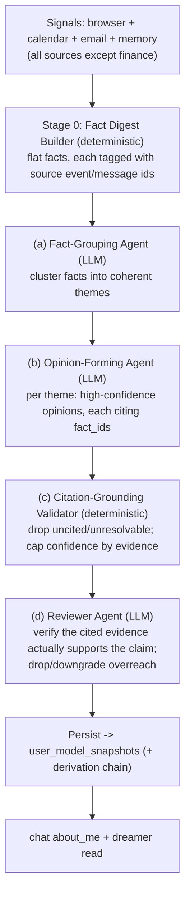

# Nidra — Opinion-Forming Workflow (fact-grounded, LLM, hourly)

- **Date:** 2026-06-27
- **Status:** Approved design, pre-implementation
- **Refines:** the Opinion layer of `2026-06-27-nidra-opinions-dreams-rsi-design.md`.
  Replaces the deterministic trait heuristics (which produced nonsense —
  decisiveness from page-load latency, deliberation from button re-clicks).

## 1. Why

The deterministic heuristics manufactured *adjectives about the user* from thin
proxies, with false confidence. The failure was the **method**, not the LLM: a
well-prompted LLM reading the *actual facts* would never conclude "decisiveness
0.0 from latency." So opinions are formed by an LLM — but **strictly fact-bound**:
high-confidence, fact-based, **cited**, no imagination. Speculation stays in Dreams.

## 2. Principles

- **Opinions = facts, not guesses.** Only state what the evidence directly supports.
- **Cite-or-omit.** Every opinion cites the exact signals (`event_ids`) behind it;
  uncited opinions are dropped. This makes "fact-based" *enforceable*, not hoped-for.
- **No imagination in opinions.** Future-guessing / unobservable personality traits
  are omitted — they are Dreams (speculative, action-validated).
- **Auditable.** Every opinion carries a `derivation` evidence chain to its facts.
- **Grounded confidence.** The LLM proposes confidence, but it is capped by evidence
  strength (citation count × source diversity) — never blindly trusted.

## 3. The workflow (4 stages → persist)

A backend pipeline (plain Python chaining the stages; the two LLM stages take an
injected completion fn so tests are deterministic — same pattern as the dreamer).



**Stage 0 — Fact Digest Builder (deterministic).** Gathers real signals from **every
source except finance** (v1) into a flat list of `Fact`s, each carrying the source
ids it came from. No conclusions. Sources:
- **browser** (persisted `browser_activity_events`) — searches, reading+engagement, choices, actions → `event_ids`;
- **calendar** (persisted `calendar_events`) — events → routine/load facts → `event_ids`;
- **email** (live via `EmailService` — gmail isn't persisted) — recent senders/subjects/dates → `ref: gmail message ids`;
- **explicit memory** (`people` / `tasks` / `notes` / `preferences`) — already-known facts → `ref: row ids`.

`Fact.event_ids` generalizes to a `ref` per source (browser/calendar row ids,
gmail message ids, memory row ids) so the evidence chain points back to the right
place. (**Finance**: Phase 2.)

```python
@dataclass
class Fact:
    id: str            # local handle for this run, e.g. "f1"
    kind: str          # search | reading | choice | action | spend | calendar | ...
    summary: str       # "searched 'flights to tokyo march'", "read 'Best ryokans' (14m, 95%)"
    event_ids: list[int]
    source: str        # browser | plaid | calendar
```

**(a) Fact-Grouping Agent (LLM).** Clusters related facts into themes so the next
stage reasons over coherent groups, not a flat blob. Prompt: *"Group these facts
into coherent themes. Use ONLY the given facts; do not invent. Output
`[{label, fact_ids}]`."*

**(b) Opinion-Forming Agent (LLM).** Per theme → opinions. Prompt (the discipline):
*"State durable, HIGH-CONFIDENCE opinions the facts DIRECTLY support. Each opinion
MUST list the `fact_ids` it rests on. State nothing the facts don't support. NO
speculation, future-guessing, or unobservable personality traits — omit those
(they are dreams, handled elsewhere). Output `[{trait, value, confidence,
evidence_fact_ids}]`."*

**(c) Citation-Grounding Validator (deterministic).** For each opinion: resolve
`evidence_fact_ids` → real `event_ids` via the digest; **drop any opinion with zero
valid citations**; cap `confidence = min(proposed, calibrated(n_citations,
n_sources))`. The mechanical anti-hallucination gate — an opinion cannot survive
without real evidence.

**(d) Reviewer Agent (LLM).** For each surviving opinion, an *independent* LLM pass
judges: **does the cited evidence actually support this claim?** It is prompted to
be skeptical — drop opinions that overreach the evidence, downgrade confidence when
the support is thin, keep only well-supported ones. Output per opinion:
`{keep, confidence_adjustment, reason}`. This is the adversarial check that catches
plausible-but-unsupported opinions the forming agent produced. (Separate prompt /
separate call from stage (b), so it's a genuine second opinion, not self-grading.)

**Persist.** Reviewer-approved opinions → `user_model_snapshots` with
`derivation = {method: "opinion-workflow", theme, fact_summaries, event_ids, review}`.
Append-only; latest-per-trait on read; recency/decay as designed.

## 4. Orchestration — hourly + manual

- **Manual:** `POST /opinions/refresh` re-pointed from the old deterministic
  `OpinionFormer` to `OpinionWorkflow`.
- **Scheduled:** an **hourly** cron line in the sidecar — `${OPINIONS_MINUTE} * * * *`
  → `POST /opinions/refresh` (default minute off `:00`, e.g. `7`). New env
  `OPINIONS_MINUTE` (+ `OPINIONS_ENABLED`), wired into compose + `.env.example`,
  mirroring the dreamer's nightly wiring.
- **Engine:** same brain selection as the dreamer — `engine_dream_fn(agent)`
  (claude-code) by default, Ollama if `AGENT_ENGINE=ollama`. The two LLM stages are
  injected fns, so the workflow is engine-agnostic + test-deterministic.

## 5. What gets retired / changed

- **Retire** `compute_browser_traits` decisiveness/deliberation (and the
  `UserModelDeriver` browser-trait path) — superseded by the workflow. Their
  signals become *facts* in the digest, not pre-computed traits.
- **v1:** `FactDigestBuilder` collects facts from **browser + calendar + email +
  explicit memory** (all sources except finance). The existing `CalendarExtractor`
  (emits `TraitSnapshot`s today) is repurposed into a calendar `Fact` collector;
  new collectors for email (via `EmailService`) and memory (`MemoryService`).
  **Finance** facts: Phase 2. The deterministic `OpinionFormer` merge is removed —
  grouping + forming now happen in the LLM stages.
- **Dreams unchanged.** `about_me` unchanged (reads snapshots, shows derivation).
- `user_model_snapshots` + `derivation` column unchanged (already built, migration
  0018). **No new migration.**

## 6. Data flow & confidence

`signals → facts(+event_ids) → themes → opinions(+fact_ids) → validated(+capped
confidence, event_ids) → snapshots`. Confidence calibration v1:
`calibrated = min(0.95, 0.5 + 0.15*(n_citations-1) + 0.15*(n_sources-1))` — a single
cited fact from one source caps at 0.5; corroboration across facts/sources raises it.
(Exact curve tunable; the point is high confidence must be *earned* by evidence.)

## 7. File-by-file change map

**Backend**
- `user_model/facts.py` (new) — `Fact` + `FactDigestBuilder` (deterministic;
  browser facts v1, finance/calendar fast-follow).
- `user_model/opinion_workflow.py` (new) — `OpinionWorkflow` (group → form →
  validate → **review** → persist), injected LLM fns (grouping, forming, reviewer);
  deterministic validator + confidence cap.
- `user_model/facts.py` — fact collectors for **browser, calendar, email
  (EmailService), and memory (MemoryService)**; each emits `Fact`s with a source
  `ref`. The `FactDigestBuilder` composes them (skips a source if its service is
  unavailable, so it degrades gracefully).
- `connectors/browser_activity/derive.py` — retire decisiveness/deliberation;
  repurpose extraction into the browser fact collector (or move to facts.py).
- `user_model/opinions.py` / `extractors.py` — repurpose to fact collectors or
  fold into the digest builder; drop trait emission.
- `api/routes/dreams.py` — `/opinions/refresh` runs `OpinionWorkflow`.
- `infra/cron/entrypoint.sh`, `infra/docker-compose.yml`, `.env.example`,
  `config.py` — hourly opinions cron + `OPINIONS_MINUTE`/`OPINIONS_ENABLED`.

## 8. Testing (TDD)

- **FactDigestBuilder:** seed signals → faithful `Fact`s with correct `event_ids`
  (deterministic).
- **Fact collectors (per source):** seed signals → faithful `Fact`s with correct
  `ref`s — browser (event_ids), calendar (event_ids), email (fake EmailService →
  message ids), memory (fake MemoryService → row ids). Builder skips unavailable
  sources.
- **OpinionWorkflow:** injected fake grouping + forming + reviewer fns → opinions
  flow group → form → validate → review → persist with derivation; assert wiring.
- **Citation validator:** opinion citing a nonexistent `fact_id` → dropped; opinion
  with N citations across M sources → confidence capped per the curve; uncited →
  dropped.
- **Reviewer agent:** a `keep:false` review drops the opinion; a
  `confidence_adjustment` lowers it; only reviewer-approved opinions persist.
- **Retire:** update/remove decisiveness/deliberation tests.
- The live LLM prompts are verified e2e (manual `/opinions/refresh` against the
  real engine), not unit-tested.

## 9. Phase 2 (noted, not built)

- **Finance fact collector** (Plaid spend/recurring → `Fact`s).
- **Retention** prune of old snapshots + recency decay on reads.

## 10. Decisions log

- Opinions are **LLM-formed but strictly fact-bound**: high-confidence, cited,
  no imagination. Speculation → Dreams.
- **Cite-or-omit** enforced by a deterministic citation validator, **then an LLM
  reviewer agent** (v1) that drops opinions overreaching their evidence.
- Pipeline: **group → form → validate → review → persist**, fed by a deterministic
  fact digest over **all sources except finance** — browser + calendar + email +
  explicit memory (finance Phase 2).
- Runs **hourly** (configurable) + **manually** via `/opinions/refresh`; same engine
  selection as the dreamer.
- Deterministic trait heuristics (decisiveness/deliberation) **retired**.
- Confidence is **capped by evidence strength**, never blindly trusted.
